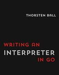

# Guile Monkey Interpreter

[](https://www.gnu.org/software/guile/)
[](https://github.com/dsp-dr/guile-monkey-interpreter)
[](LICENSE)
[](https://www.scheme.org/)
[](https://asciinema.org/a/5dA4ntDtB4PN1WpU4FZBgfWwW)

A Scheme implementation of the Monkey programming language interpreter from Thorsten Ball's ["Writing An Interpreter in Go"](https://interpreterbook.com/), written in GNU Guile Scheme.



## Overview

This project implements a complete interpreter for the Monkey programming language, following the book's structure but adapted for Scheme idioms and extended with additional features.

## 🎬 Live Demo


*Watch the interpreter in action, demonstrating arithmetic, functions, arrays, and Chapter 4 extensions*

[View on asciinema](https://asciinema.org/a/5dA4ntDtB4PN1WpU4FZBgfWwW) for full interactive playback.

### Features

- ✅ Complete Lexer with all Monkey tokens
- ✅ Pratt Parser with operator precedence
- ✅ Tree-walking evaluator
- ✅ First-class functions and closures
- ✅ Built-in data types: integers, booleans, strings, arrays, hashes
- ✅ Built-in functions: `len`, `first`, `last`, `rest`, `push`, `puts`
- ✅ REPL (Read-Eval-Print-Loop)
- 🔧 **Extension**: While loops
- 🔧 **Extension**: Enhanced error messages
- 🚀 **Chapter 4**: Extended built-in functions
  - `type()` - Get object type
  - `str()` - Convert to string
  - `int()` - Parse integer
  - `split()` - Split strings
  - `join()` - Join arrays
  - `contains()` - Check containment
  - `keys()` - Get hash keys
  - `values()` - Get hash values
  - `delete()` - Delete from hash
- 🆕 **Quick Win Extensions**: Additional built-in functions
  - `map()` - Transform array elements
  - `filter()` - Filter array by predicate
  - `reduce()` - Fold array to single value
  - `sort()` - Sort array elements
  - `abs()` - Absolute value
  - `min()` - Minimum value
  - `max()` - Maximum value
  - `trim()` - Trim whitespace from strings
  - `replace()` - Replace substring
  - `substring()` - Extract substring

## Project Structure

```
guile-monkey-interpreter/
├── src/monkey/             # Core interpreter source code
├── code/                   # Book chapter implementations (01-04)
├── tutorials/              # Learning materials and guides
├── experiments/            # Feature experiments (00X) & tools (10X)
├── tests/                  # Test suite with integration tests
├── examples/               # Example Monkey programs
├── scripts/                # Utility scripts and debugging tools
├── docs/                   # Technical documentation and reports
└── demo/                   # Demo recordings and materials
```

**Key directories:**
- `src/monkey/` - The complete interpreter implementation
- `tutorials/` - Start here if you're new to the project
- `experiments/` - Explore language extensions and debugging tools
- `examples/` - See Monkey in action with sample programs

## Quick Start

### Prerequisites

- GNU Guile 3.0 or later
- GNU Make (optional, use `gmake` on BSD systems)
- Git for cloning the repository

### Installation

```bash
# Clone the repository
git clone https://github.com/dsp-dr/guile-monkey-interpreter.git
cd guile-monkey-interpreter

# Run the complete interpreter
gmake repl  # Use 'make' on Linux

# Or run directly
guile -L src src/monkey/main.scm

# Run tests
gmake test
```

📚 **For detailed setup instructions, see the [Installation Guide](tutorials/01-getting-started/01-installation.md)**

### Running Tests

```bash
# Run all tests
make test

# Run specific test suites
./scripts/test.sh lexer
./scripts/test.sh parser
./scripts/test.sh evaluator
```

## The Monkey Language

Monkey is a dynamically typed programming language with C-like syntax. Here are some examples:

### Basic Operations

```monkey
// Variables and arithmetic
let x = 5;
let y = 10;
let result = (x + y) * 2; // 30

// Strings
let name = "Monkey";
let greeting = "Hello, " + name + "!";

// Arrays
let numbers = [1, 2, 3, 4, 5];
let first = numbers[0]; // 1

// Hashes
let person = {"name": "Alice", "age": 30};
let name = person["name"]; // "Alice"
```

### Functions

```monkey
// Function definition
let add = fn(a, b) {
    return a + b;
};

// Function call
let sum = add(5, 3); // 8

// Higher-order functions
let twice = fn(f, x) {
    return f(f(x));
};

let addTwo = fn(x) {
    return x + 2;
};

twice(addTwo, 5); // 9
```

### Control Flow

```monkey
// If expressions
let max = fn(a, b) {
    if (a > b) {
        return a;
    } else {
        return b;
    }
};

// While loops (extension)
let factorial = fn(n) {
    let result = 1;
    let i = n;
    while (i > 1) {
        let result = result * i;
        let i = i - 1;
    }
    return result;
};
```

### Built-in Functions

```monkey
// Array operations
let arr = [1, 2, 3];
len(arr);           // 3
first(arr);         // 1
last(arr);          // 3
rest(arr);          // [2, 3]
push(arr, 4);       // [1, 2, 3, 4]

// String operations
len("hello");       // 5

// Output
puts("Hello, World!"); // Prints to stdout
```

## Learning Resources

### 📚 Tutorials

Comprehensive tutorials are available in the [`tutorials/`](tutorials/) directory:

- **[Getting Started](tutorials/01-getting-started/)** - Installation, first program, REPL usage
- **[Language Features](tutorials/02-language-features/)** - Complete Monkey language guide
- **[Extending Monkey](tutorials/03-extending-monkey/)** - Add new features and built-ins
- **[Debugging Guide](tutorials/04-debugging/)** - Tools and techniques for debugging
- **[Advanced Topics](tutorials/05-advanced-topics/)** - Architecture and internals

### 🛠️ Debugging Tools

- **Interactive tmux session**: `./scripts/tmux-guile.sh` - Pre-configured debugging environment
- **GDB integration**: `./scripts/gdb-guile.sh` - Low-level debugging support
- **Visualization tools**: Generate Mermaid diagrams for AST, control flow, and module dependencies

## Development Guide

### Chapter Progression

Each chapter in the `code/` directory represents a milestone from the book:

1. **Chapter 01 - Lexing**: Tokenization of source code
2. **Chapter 02 - Parsing**: Building the Abstract Syntax Tree
3. **Chapter 03 - Evaluation**: Basic evaluation and REPL
4. **Chapter 04 - Extending**: Arrays, hashes, and built-in functions

### Running Chapter Code

```bash
# Run Chapter 1 REPL (lexer only)
cd code/01
guile -L src/monkey --no-auto-compile -l main.scm

# Run Chapter 2 REPL (lexer + parser)
cd code/02
guile -L src/monkey --no-auto-compile -l main.scm

# And so on...
```

### Module Structure

Each component is a Guile module:

```scheme
;; src/monkey/lexer/lexer.scm
(define-module (monkey lexer lexer)
  #:use-module (monkey token token)
  #:export (make-lexer
            next-token))
```

### Testing

Tests use SRFI-64:

```scheme
;; tests/lexer-test.scm
(use-modules (srfi srfi-64)
             (monkey lexer lexer)
             (monkey token token))

(test-begin "lexer")

(test-equal "tokenize operators"
  (list (make-token 'PLUS "+")
        (make-token 'MINUS "-"))
  (tokenize "+ -"))

(test-end "lexer")
```

## Extensions Beyond the Book

### Implemented

- **While Loops**: Traditional iterative loops
  ```monkey
  while (condition) {
      // body
  }
  ```

### Planned

- [ ] For loops
- [ ] Break/Continue statements
- [ ] String interpolation
- [ ] Import/Module system
- [ ] Tail call optimization
- [ ] Pattern matching

## Contributing

Contributions are welcome! This is an educational project focused on learning.

See [CONTRIBUTING.md](CONTRIBUTING.md) for guidelines on:
- Code organization and style
- Testing requirements  
- Documentation standards
- Submitting pull requests

## Resources

### Documentation
- [📚 Tutorials](tutorials/) - Step-by-step learning guides
- [📖 Technical Docs](docs/) - Implementation details
- [🔬 Experiments](experiments/) - Language extensions and analysis
- [💡 Examples](examples/) - Sample Monkey programs

### External Resources
- [Writing An Interpreter in Go](https://interpreterbook.com/) - The original book
- [Guile Reference Manual](https://www.gnu.org/software/guile/manual/)
- [SRFI Documents](https://srfi.schemers.org/) - Scheme standards

## Security

⚠️ **Educational Project - Not for Production Use**

This interpreter is for learning purposes only. See [SECURITY.md](SECURITY.md) for important warnings about:
- Not running untrusted code
- No sandboxing or security boundaries
- Educational vs. production use

## License

MIT License - see [LICENSE](LICENSE) file for details.

## Acknowledgments

- Thorsten Ball for the excellent book and Monkey language design
- The Guile Scheme community for a fantastic implementation
- Contributors to this project
