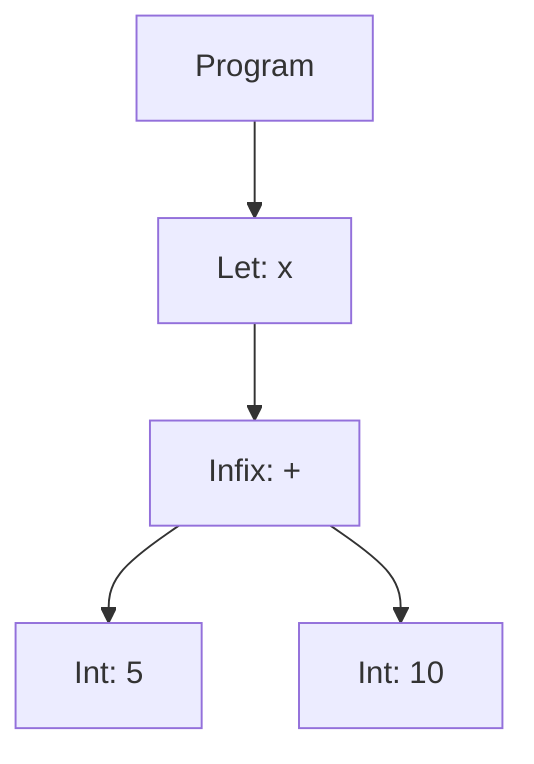
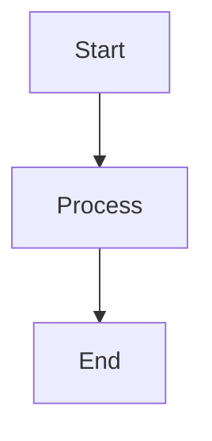

# Mermaid Visualization Tools for Monkey Interpreter

This experiment provides visualization tools to generate Mermaid diagrams for understanding the Monkey interpreter's structure and execution flow.

## Tools

### 1. AST Diagram Generator
Visualizes the Abstract Syntax Tree for Monkey code.

```bash
./generate-ast-diagram.scm "let x = 5 + 10;"
```

Output:


### 2. Module Dependency Graph
Shows dependencies between Guile modules in the interpreter.

```bash
cd ../../  # Run from src directory
./experiments/103-mermaid-visualizer/generate-module-graph.scm
```

This generates a graph showing how parser, evaluator, AST, and other modules are interconnected.

### 3. Control Flow Diagram
Illustrates the interpreter's execution flow from source code to result.

```bash
./generate-control-flow.scm > control-flow.mmd
```

The diagram shows:
- Lexer → Parser → Evaluator pipeline
- Statement vs Expression evaluation paths
- Loop control flow (break/continue)
- Environment management

### 4. Sequence Diagram
Shows the detailed execution sequence for interpreter operations.

```bash
./generate-sequence-diagram.scm > sequence.mmd
```

This creates a sequence diagram showing:
- User input flow through REPL
- Token generation and parsing
- AST evaluation steps
- Environment interactions
- Object creation

## Usage Examples

### Complex Expression AST
```bash
./generate-ast-diagram.scm "if (x > 5) { x * 2 } else { x + 1 }"
```

### Function Definition AST
```bash
./generate-ast-diagram.scm "let add = fn(a, b) { a + b };"
```

### Array and Hash Literals
```bash
./generate-ast-diagram.scm "[1, 2, 3]; {\"key\": \"value\"}"
```

## Rendering Diagrams

### Online (Mermaid Live Editor)
1. Copy the generated Mermaid code
2. Visit https://mermaid.live
3. Paste the code to see the rendered diagram

### VS Code
Install the "Mermaid Preview" extension to view `.mmd` files directly.

### Command Line
```bash
# Install mermaid-cli
npm install -g @mermaid-js/mermaid-cli

# Generate PNG/SVG
mmdc -i diagram.mmd -o diagram.png
mmdc -i diagram.mmd -o diagram.svg
```

### Markdown
Include in markdown files:
````markdown

````

## Implementation Notes

### AST Visualization
- Each AST node type has a specific representation
- Parent-child relationships shown with arrows
- Node IDs are auto-generated for uniqueness
- Supports all Monkey language constructs

### Module Graph Analysis
- Parses `define-module` forms
- Extracts `#:use-module` declarations
- Filters to show only internal dependencies
- Color-codes modules by type (parser, evaluator, AST)

### Control Flow
- Shows decision points as diamonds
- Process steps as rectangles
- Terminal states as rounded rectangles
- Loop control flow explicitly modeled

### Sequence Diagrams
- Participants represent system components
- Activation boxes show active processing
- Loops and alternatives clearly marked
- Notes explain complex interactions

## Debugging Benefits

These visualization tools were crucial in debugging the parser issues:

1. **AST Diagrams** helped verify parser output correctness
2. **Module Graphs** revealed circular dependencies
3. **Control Flow** identified evaluation bottlenecks
4. **Sequence Diagrams** clarified execution order issues

## Future Enhancements

- [ ] Interactive diagram generation from REPL
- [ ] Diff visualization between ASTs
- [ ] Runtime trace visualization
- [ ] Performance overlay on diagrams
- [ ] Export to multiple formats (DOT, PlantUML)

## Contributing

To add new visualization types:

1. Create a new generator script following the pattern
2. Use the existing helper functions for Mermaid syntax
3. Test with various Monkey code examples
4. Document the output format

## License

Part of the Monkey Interpreter project - see main LICENSE file.