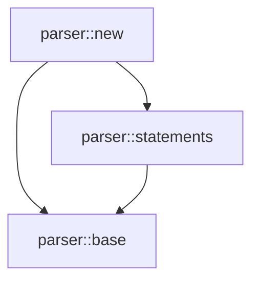

# Guile Scheme Debugging Workshop: A Practical Guide

## Introduction

This workshop documents the debugging journey of fixing complex parser issues in a Guile Scheme implementation of the Monkey programming language interpreter. Through this real-world case study, we'll explore practical debugging techniques, tools we developed, and lessons learned.

## The Problem: Parser Parenthesis Chaos

We encountered a critical issue where our parser module (`parser.scm`) had mismatched parentheses, causing:
- "definition in expression context" errors
- Functions being interpreted as nested expressions
- Complete module loading failure

## Part 1: Initial Debugging Techniques

### 1.1 Interactive REPL Debugging

The Guile REPL provides powerful debugging commands that many developers aren't aware of:

```scheme
;; Load your module in the REPL
scheme@(guile-user)> (load "parser.scm")

;; When an error occurs, use these commands:
,bt          ; Show backtrace
,frame N     ; Jump to frame N
,locals      ; Show local variables in current frame
,up / ,down  ; Navigate the call stack
```

### 1.2 Setting Breakpoints

```scheme
;; Set a breakpoint in a function
,break parse-hash-literal

;; Or add breakpoints programmatically
(add-to-load-path ".")
(use-modules (system vm trap-state))
(install-trap (make <procedure-trap>
               #:procedure parse-hash-literal
               #:handler (lambda (frame)
                          (format #t "Hit breakpoint!~%")
                          (pk 'locals (frame-local-variables frame)))))
```

### 1.3 Tracing Function Calls

```scheme
,trace (parse-expression parser LOWEST)
```

## Part 2: Custom Debugging Tools We Developed

### 2.1 Parenthesis Balance Checker

```scheme
#!/usr/bin/env guile
!#
;;; balance-parens.scm - Check parenthesis balance in source files

(use-modules (ice-9 format))

(define (check-balance filename)
  "Check parenthesis balance with detailed position tracking"
  (with-input-from-file filename
    (lambda ()
      (let loop ((char (read-char))
                 (line 1)
                 (col 1)
                 (depth 0)
                 (stack '()))
        (cond
         ((eof-object? char)
          (if (zero? depth)
              (format #t "✓ File is balanced~%")
              (format #t "✗ Unbalanced: depth ~a at EOF~%" depth)))
         ((char=? char #\newline)
          (loop (read-char) (+ line 1) 1 depth stack))
         ((char=? char #\()
          (loop (read-char) line (+ col 1) (+ depth 1) 
                (cons (list 'open line col) stack)))
         ((char=? char #\))
          (if (zero? depth)
              (format #t "✗ Extra closing paren at line ~a, col ~a~%" line col)
              (loop (read-char) line (+ col 1) (- depth 1) (cdr stack))))
         (else
          (loop (read-char) line (+ col 1) depth stack)))))))

(check-balance "parser.scm")
```

### 2.2 Function Boundary Finder

```scheme
#!/usr/bin/env guile
!#
;;; find-function-boundaries.scm - Identify where functions actually end

(use-modules (ice-9 format)
             (ice-9 match))

(define (find-functions filename)
  "Find all function definitions and their actual boundaries"
  (with-input-from-file filename
    (lambda ()
      (let loop ((expr (read))
                 (pos 1))
        (unless (eof-object? expr)
          (match expr
            (('define (name . args) . body)
             (format #t "Function: ~a at position ~a~%" name pos)
             (format #t "  Expected depth after definition: 0~%")
             (format #t "  Body forms: ~a~%" (length body)))
            (('define name value)
             (format #t "Variable: ~a at position ~a~%" name pos))
            (_ #f))
          (loop (read) (+ pos 1)))))))

(find-functions "parser.scm")
```

### 2.3 AST Dumper for Debugging

```scheme
(define (dump-ast node indent)
  "Pretty-print AST structure for debugging"
  (let ((spaces (make-string indent #\space)))
    (cond
     ((program? node)
      (format #t "~aProgram:~%" spaces)
      (for-each (lambda (stmt) 
                  (dump-ast stmt (+ indent 2)))
                (program-statements node)))
     ((let-statement? node)
      (format #t "~aLet: ~a =~%" spaces 
              (identifier-value (let-statement-name node)))
      (dump-ast (let-statement-value node) (+ indent 2)))
     ((infix-expression? node)
      (format #t "~aInfix: ~a~%" spaces 
              (infix-expression-operator node))
      (dump-ast (infix-expression-left node) (+ indent 2))
      (dump-ast (infix-expression-right node) (+ indent 2)))
     ;; Add more node types as needed
     (else
      (format #t "~a~a~%" spaces node)))))
```

## Part 3: The Modular Solution

When debugging became intractable, we rebuilt the parser with a modular architecture:

### 3.1 Module Structure

```
parser-new.scm          # Main module orchestrator
parser-base.scm         # Core infrastructure
parser-statements.scm   # Statement parsing
parser-expressions.scm  # Expression parsing  
parser-literals.scm     # Literal parsing
```

### 3.2 Benefits of Modularization

1. **Isolation**: Errors in one module don't cascade
2. **Testability**: Each module can be tested independently
3. **Readability**: Smaller files are easier to debug
4. **Maintainability**: Changes are localized

### 3.3 Module Template

```scheme
(define-module (monkey parser parser-base)
  #:use-module (monkey ast ast)
  #:use-module (monkey token token)
  #:export (make-parser*
            parser?
            parser-lexer
            parser-cur-token
            parser-peek-token
            parser-errors
            ;; ... other exports
            ))

;; Module implementation
(define (make-parser* lexer)
  ...)
```

## Part 4: Visualization Tools

### 4.1 Mermaid Diagram Generators

We created tools to visualize:
- Module dependencies
- Control flow
- AST structure
- Execution sequences

Example usage:
```bash
./generate-module-graph.scm > module-deps.mmd
./generate-ast-diagram.scm "let x = 5 + 5;" > ast.mmd
```

### 4.2 Module Dependency Graph



## Part 5: Lessons Learned

### 5.1 Debugging Strategies

1. **Start with static analysis**: Check syntax before runtime
2. **Use the REPL**: Interactive debugging is powerful
3. **Build custom tools**: Don't hesitate to create specialized debuggers
4. **Modularize early**: Smaller modules are easier to debug
5. **Visualize structures**: Diagrams reveal patterns

### 5.2 Common Pitfalls

1. **Continuation interference**: `call/cc` and `with-return` can conflict
2. **Nested macros**: Can obscure actual code structure
3. **Large files**: Make debugging exponentially harder
4. **Missing exports**: Silent failures in module systems

### 5.3 The Power of Scheme's Introspection

```scheme
;; Inspect procedure properties
(procedure-properties parse-expression)

;; Get source location
(procedure-source parse-expression)

;; Module introspection
(module-uses (resolve-module '(monkey parser parser-new)))
```

## Part 6: Advanced Debugging Techniques

### 6.1 Using GDB with Guile

```bash
# Compile with debug symbols
guile-snarf -o parser.x parser.c
gcc -g -O0 -shared -o parser.so parser.c `pkg-config --cflags --libs guile-3.0`

# Debug with GDB
gdb guile
(gdb) run -l parser.scm
(gdb) break scm_error
```

### 6.2 Performance Profiling

```scheme
(use-modules (statprof))

(statprof
  (lambda ()
    (parse-program (make-parser (make-lexer test-input)))))
```

### 6.3 Memory Debugging

```scheme
(use-modules (system vm trace))

(trace-calls-to-procedure
  parse-expression
  (lambda (frame)
    (format #t "Memory: ~a~%" (assoc-ref (gc-stats) 'heap-size))))
```

## Part 7: Workshop Exercises

### Exercise 1: Debug a Parenthesis Mismatch

Given this broken code:
```scheme
(define (broken-function x)
  (if (> x 0)
      (begin
        (display "positive")
        (+ x 1)))
      (begin
        (display "negative")
        (- x 1))))  ; Extra closing paren!
```

Use the balance checker to find the issue.

### Exercise 2: Trace Execution Flow

```scheme
(define (factorial n)
  (if (<= n 1)
      1
      (* n (factorial (- n 1)))))

;; Add tracing
,trace (factorial 5)
```

### Exercise 3: Create a Custom Debugger

Build a simple debugger that:
1. Tracks function entry/exit
2. Shows argument values
3. Displays return values

## Part 8: Community Resources

### Addressing Forum Concerns

Based on the System Crafters forum discussion:

1. **"Debugging feels like navigating in the dark"**
   - Solution: Use visualization tools
   - Create custom debuggers for your domain
   - Document your debugging journey

2. **"GNU manuals lack practical examples"**
   - This workshop provides real-world examples
   - Each technique is demonstrated with actual code
   - Errors and solutions are documented

3. **"Different REPLs have different capabilities"**
   - Standard Guile REPL: Full debugging support
   - Guix REPL: Limited debugging features
   - Geiser (Emacs): Enhanced integration

### Recommended Workflow

1. **Development Environment**:
   ```bash
   # Terminal 1: REPL for testing
   guile --auto-compile=0
   
   # Terminal 2: File watcher
   ls *.scm | entr -c guile test-suite.scm
   
   # Terminal 3: Editor
   emacs -nw parser.scm
   ```

2. **Debugging Session**:
   ```scheme
   ;; In REPL
   ,use (monkey parser parser-new)
   ,break parse-for-expression
   (parse-program (make-parser (make-lexer "for (i=0; i<10; i++) {}")))
   ,bt
   ,frame 3
   ,locals
   ```

## Conclusion

Debugging Guile Scheme can be challenging, but with the right tools and techniques, it becomes manageable. The key insights:

1. **Use the REPL's debugging commands** - They're more powerful than most realize
2. **Build custom tools** - Scheme's flexibility allows targeted debuggers
3. **Modularize your code** - Smaller modules = easier debugging
4. **Visualize your structures** - Diagrams reveal hidden patterns
5. **Document your journey** - Future you will thank present you

This workshop demonstrates that while Guile's debugging story could be improved, the language provides enough power to build effective debugging workflows. The tools and techniques developed here can be adapted to any Guile project.

## Appendix: Quick Reference

### REPL Commands
```
,help debug     - Show all debug commands
,bt            - Backtrace
,up / ,down    - Navigate frames
,frame N       - Jump to frame N
,locals        - Show local variables
,break PROC    - Set breakpoint
,trace PROC    - Trace procedure calls
,profile EXPR  - Profile expression
```

### Useful Modules
```scheme
(use-modules (system vm trace))      ; Tracing
(use-modules (system vm trap-state)) ; Breakpoints
(use-modules (statprof))            ; Profiling
(use-modules (ice-9 debug))         ; Debug utilities
```

### Error Handling Pattern
```scheme
(catch #t
  (lambda () 
    ;; Your code here
    (parse-program parser))
  (lambda (key . args)
    (format #t "Error: ~a~%" key)
    (format #t "Args: ~a~%" args)
    (backtrace)))
```

Remember: Debugging is a skill that improves with practice. Each bug you solve makes you better at solving the next one.