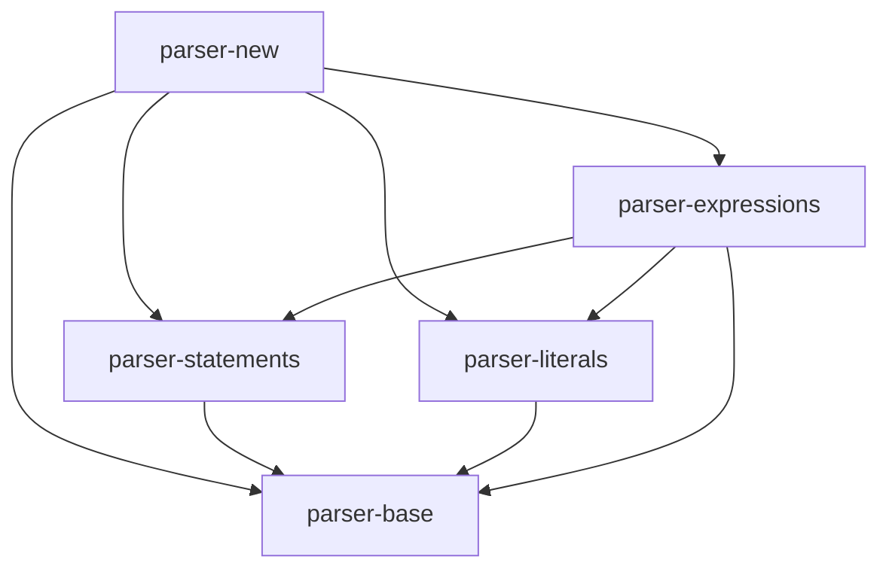
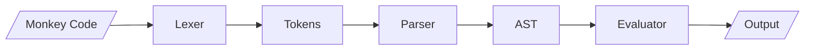

# Experiment 103: Mermaid Diagram Generator for Monkey Interpreter

## Objective
Create tools to automatically generate Mermaid diagrams showing:
1. Control flow of the Monkey interpreter
2. Module dependencies
3. AST structure for parsed programs
4. Evaluation sequence diagrams

## Mermaid Diagram Types

### 1. Module Dependency Graph
Shows how different modules depend on each other.

### 2. Control Flow Diagram
Visualizes the flow from lexing through parsing to evaluation.

### 3. AST Structure Diagram
Shows the tree structure of parsed Monkey programs.

### 4. Sequence Diagram
Shows the sequence of calls during program evaluation.

## Implementation

The tools analyze the Guile modules and generate Mermaid syntax that can be rendered in:
- GitHub README files
- Documentation sites
- VS Code with Mermaid preview extension
- Online Mermaid live editor

## Usage

```bash
# Generate module dependency diagram
./generate-module-graph.scm > module-graph.mmd

# Generate control flow diagram  
./generate-control-flow.scm > control-flow.mmd

# Generate AST diagram for a program
./generate-ast-diagram.scm "let x = 5 + 10;" > ast.mmd

# Generate sequence diagram
./generate-sequence-diagram.scm "fn(x) { x + 1 }(5)" > sequence.mmd
```

## Example Output

### Module Dependency Graph


### Control Flow


## Benefits
1. Visual understanding of interpreter architecture
2. Documentation that stays in sync with code
3. Debugging aid for complex flows
4. Teaching tool for understanding interpreters